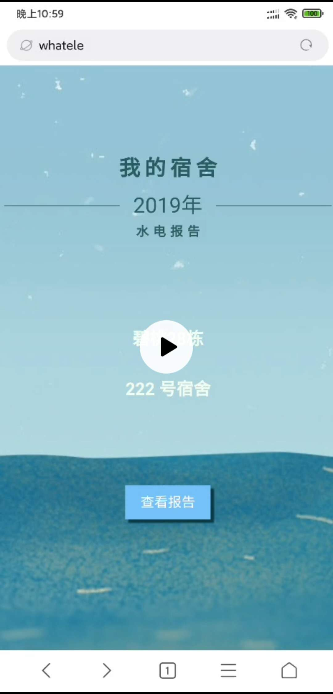
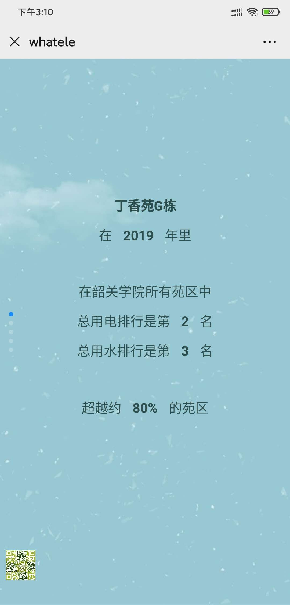
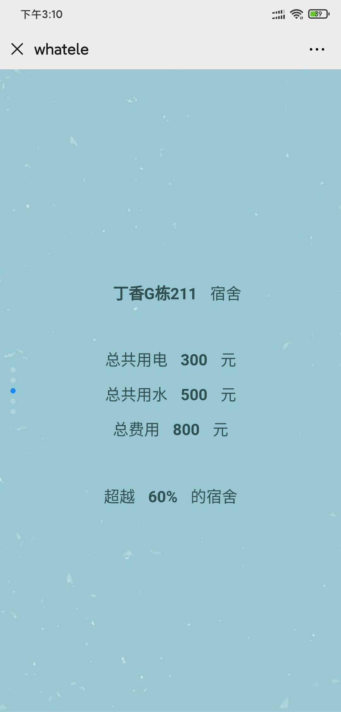
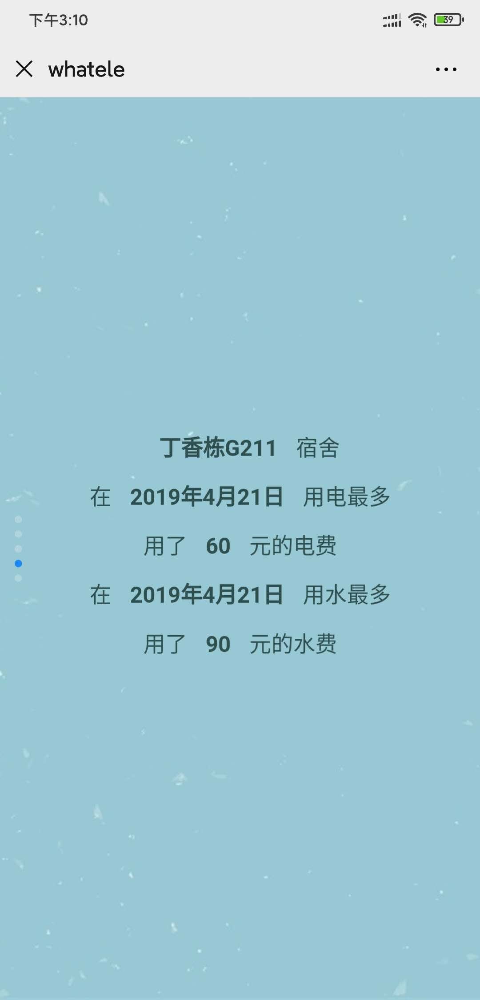
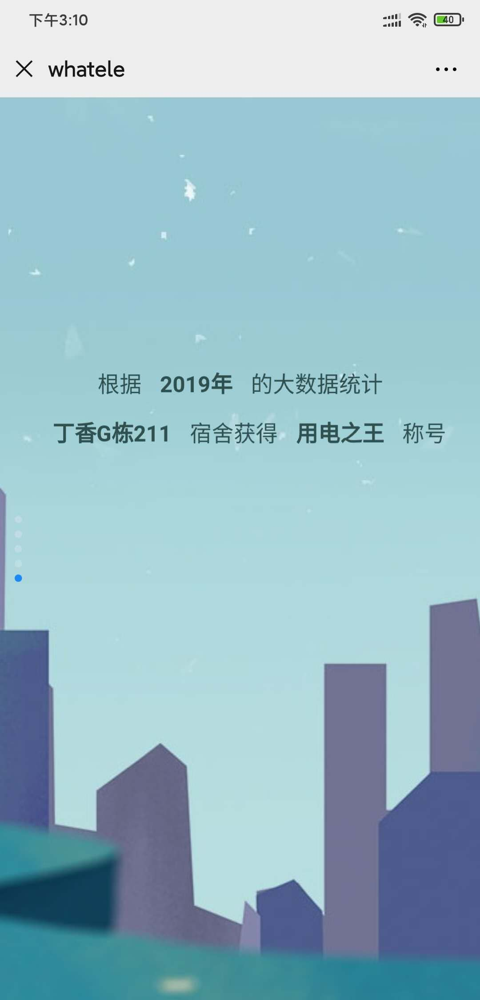

基于Vue框架的韶关学院2019大数据水电统计页面
====
项目简介
----
    校园水电费使用情况
    年度大总结的页面

项目依赖
----
- Vue 
- animate.css 
- axios
- element-ui
- vant
- wow.js

项目示例
----

安装部署
----
>安装依赖 
npm install  
运行环境 
npm run dev 
生成文件 
npm run build

项目开发者
----
@Cenita
ChenHuiTao
